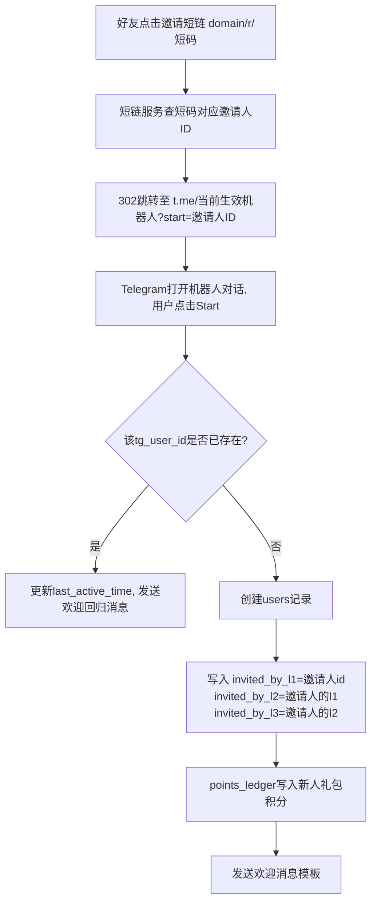
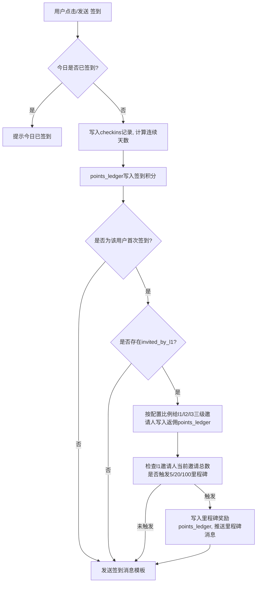
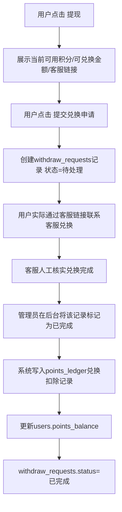
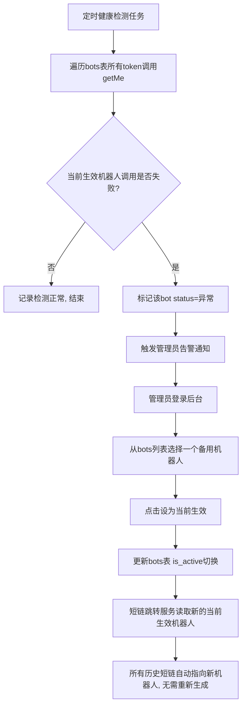
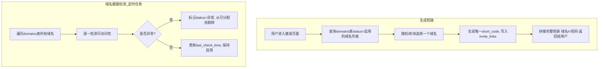
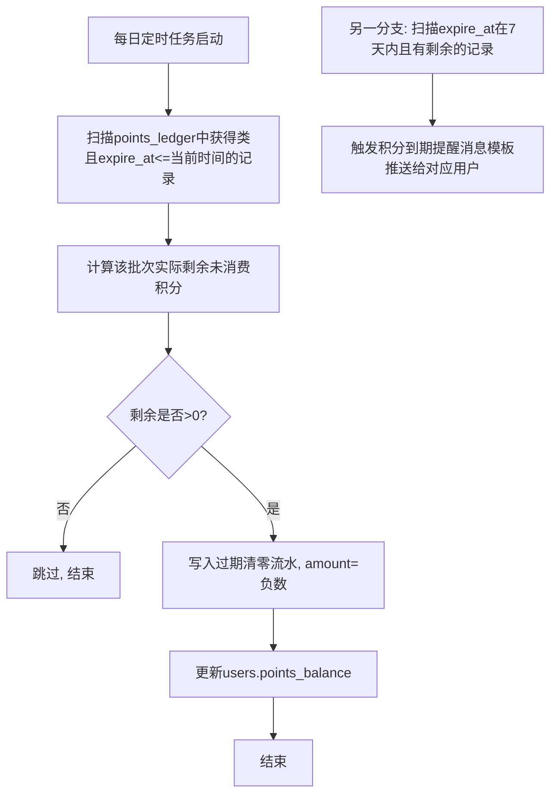
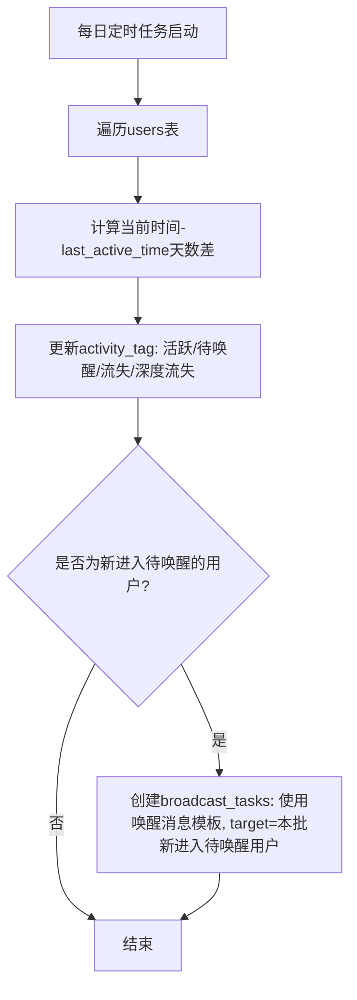
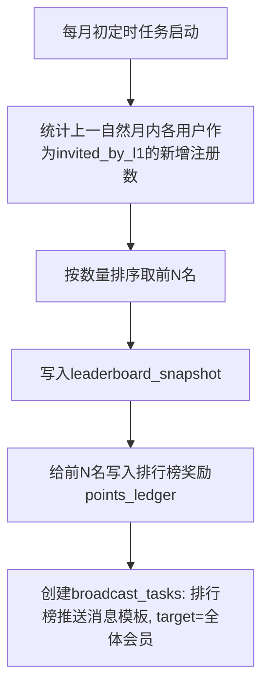

# TG机器人 —— 数据库表结构与交互流程图

> 基于《TG机器人功能设计与裂变方案》v6 整理，2026-07-13

---

## 一、数据库表结构

### 1. users（会员表）

| 字段 | 类型 | 说明 |
|---|---|---|
| id | bigint, PK | 内部自增主键 |
| tg_user_id | bigint, unique | Telegram 用户ID |
| tg_username | varchar | Telegram 用户名，可能为空 |
| nickname | varchar | 展示昵称 |
| invited_by_l1 | bigint, 可空 | 直接邀请人 user.id |
| invited_by_l2 | bigint, 可空 | 二级邀请人（邀请人的邀请人） |
| invited_by_l3 | bigint, 可空 | 三级邀请人 |
| points_balance | int | 当前可用积分（冗余字段，便于快速展示，权威数据以 points_ledger 汇总为准，定期对账） |
| register_time | datetime | 注册时间 |
| last_active_time | datetime | 最近一次签到/邀请等行为时间 |
| checkin_streak | int | 当前连续签到天数 |
| last_checkin_date | date | 最近签到日期 |
| identity_level | enum | 身份等级：注册会员/邀请达人/团队长/VIP大使 |
| activity_tag | enum | 活跃度层级：活跃/待唤醒/流失/深度流失（每日定时任务更新） |
| is_high_value | boolean | 高价值用户标记 |
| device_fingerprint | varchar | 设备指纹，用于防刷 |
| register_ip | varchar | 注册IP |
| status | enum | 正常/拉黑 |

**关键设计说明**：3级返佣不用递归查询或路径字符串，而是在用户注册时直接算好并写死 `invited_by_l1/l2/l3` 三个字段（新用户的 l1 = 邀请人id，l2 = 邀请人的l1，l3 = 邀请人的l2）。这样返佣结算时直接读这3个字段即可，不需要遍历邀请树，性能和实现复杂度都更友好。

### 2. invite_links（邀请短链表）

| 字段 | 类型 | 说明 |
|---|---|---|
| id | bigint, PK | |
| user_id | bigint, FK→users | 该短链归属的邀请人 |
| short_code | varchar, unique | 短码 |
| domain_id | bigint, FK→domains | 生成时从域名池中分配到的域名 |
| click_count | int | 累计点击数 |
| created_at | datetime | |

### 3. domains（域名池）

| 字段 | 类型 | 说明 |
|---|---|---|
| id | bigint, PK | |
| domain | varchar | 域名 |
| status | enum | 启用/禁用/异常 |
| last_check_time | datetime | 最近一次健康检测时间 |
| last_check_result | varchar | 检测结果详情 |

### 4. bots（机器人配置表）

| 字段 | 类型 | 说明 |
|---|---|---|
| id | bigint, PK | |
| token | varchar，加密存储 | Bot Token |
| bot_username | varchar | 调用 getMe 后自动回填 |
| status | enum | 启用/禁用/异常 |
| is_active | boolean | 全表有且仅有一条为 true，代表当前生效机器人 |
| last_health_check_time | datetime | |

### 5. points_ledger（积分流水/账变记录，核心表）

| 字段 | 类型 | 说明 |
|---|---|---|
| id | bigint, PK | |
| user_id | bigint, FK→users | |
| change_type | enum | 签到 / 邀请一级返佣 / 邀请二级返佣 / 邀请三级返佣 / 里程碑奖励 / 排行榜奖励 / 新人礼包 / 兑换扣除 / 后台调整 / 过期清零 |
| amount | int | 正负数 |
| balance_after | int | 变动后余额快照 |
| related_user_id | bigint, 可空 | 邀请返佣场景下，记录触发这笔奖励的下级用户 |
| expire_at | datetime, 可空 | 仅"获得类"流水需要，供积分过期批处理扫描 |
| operator | varchar, 可空 | 后台调整/兑换核销时的操作管理员 |
| created_at | datetime | |

### 6. checkins（签到记录表）

| 字段 | 类型 | 说明 |
|---|---|---|
| id | bigint, PK | |
| user_id | bigint, FK→users | |
| checkin_date | date | |
| streak_at_checkin | int | 当次签到时的连续天数快照 |
| points_earned | int | 当次获得积分 |

### 7. withdraw_requests（提现申请表）

| 字段 | 类型 | 说明 |
|---|---|---|
| id | bigint, PK | |
| user_id | bigint, FK→users | |
| points_amount | int | 申请兑换的积分数 |
| exchange_amount | decimal | 按当时兑换比例计算出的可兑换金额快照 |
| status | enum | 待处理/已完成 |
| applied_at | datetime | |
| completed_at | datetime, 可空 | |
| operator | varchar, 可空 | 标记完成的管理员 |

### 8. message_templates（消息模板表）

| 字段 | 类型 | 说明 |
|---|---|---|
| id | bigint, PK | |
| type | enum | 欢迎/邀请/签到/我的/唤醒/积分到期提醒/月度排行榜 |
| title | varchar | |
| content | text | 支持变量占位符的图文内容 |
| image_url | varchar, 可空 | |
| updated_at | datetime | |
| updated_by | varchar | |

### 9. broadcast_tasks（群发任务表）

| 字段 | 类型 | 说明 |
|---|---|---|
| id | bigint, PK | |
| template_id | bigint, FK→message_templates | |
| target_filter | json | 筛选条件（活跃度层级/身份等级/自定义用户列表等） |
| scheduled_time | datetime | |
| status | enum | 待发送/发送中/已完成/失败 |
| total_target_count | int | |
| sent_count | int | |
| click_count | int | |
| created_by | varchar | |

### 10. points_config（积分配置表，key-value）

示例 key：`checkin_base_points`、`invite_l1_points`、`invite_l2_points`、`invite_l3_points`、`points_expire_months`、`milestone_5_bonus`、`milestone_20_bonus`、`milestone_100_bonus`、`exchange_rate`

### 11. leaderboard_snapshot（月度排行榜快照表）

| 字段 | 类型 | 说明 |
|---|---|---|
| id | bigint, PK | |
| period | varchar | 如 "2026-07" |
| user_id | bigint, FK→users | |
| rank | int | |
| invite_count_this_period | int | 当月新增直接邀请数 |
| reward_points | int | 该名次获得的奖励积分 |

### 12. admin_users（管理员表）

| 字段 | 类型 | 说明 |
|---|---|---|
| id | bigint, PK | |
| username | varchar | |
| password_hash | varchar | |
| role | enum | 超级管理员/客服/运营 |
| created_at | datetime | |

---

## 二、需要你确认的两个实现细节

**1）积分过期的精度**：`points_ledger` 里每笔"获得类"流水都带 `expire_at`，理论上最精确的做法是消费积分时按"先进先出"（FIFO）从最早未过期的批次开始扣减，这样才能准确知道每一笔积分自己还剩多少、什么时候到期。但 FIFO 批次扣减逻辑实现和测试成本不低。一个简化替代方案是按"月度批次"汇总（比如"2026年7月获得的积分"作为一个整体批次，到期时间统一按当月最后一天+12个月计算），精度略低（做不到精确到某一天获得的积分），但工程量小很多。你更倾向哪种？

**2）月度排行榜推送范围**：目前设计里没明确排行榜消息模板是推送给全体会员看榜单（制造"我也想上榜"的氛围，但会增加群发量），还是只通知上榜的前N名（群发量小，但传播效果打折扣）。建议是推给全体，因为"榜单"本身就是靠"别人看到你的名字"来驱动竞争欲，只通知本人意义不大。你确认一下这个方向。

---

## 三、机器人交互流程图

### 1. 注册与邀请关系建立

### 2. 签到与邀请返佣触发

### 3. 提现申请

### 4. 机器人容灾切换

### 5. 短链生成与域名健康检测

### 6. 积分过期批处理（定时任务）

### 7. 会员活跃度层级更新与唤醒推送（定时任务）

### 8. 月度邀请排行榜结算与推送

---

## 四、待确认事项汇总
- 积分过期精度：FIFO精确批次 vs 月度批次简化方案
- 月度排行榜推送范围：全体会员 vs 仅上榜用户
